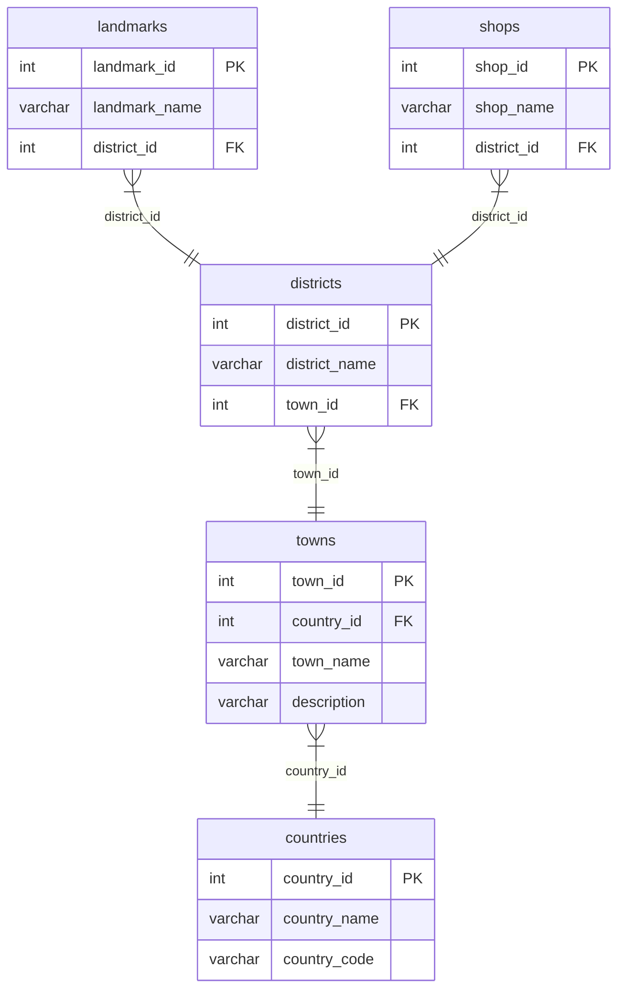

```mermaid
erDiagram

towns {
    int town_id PK
    int country_id FK
    varchar town_name
    varchar description
}

countries {
    int country_id PK
    varchar country_name
    varchar country_code
}

towns }|--|| countries : country_id

districts {
    int district_id PK
    varchar district_name
    int town_id FK
}

districts }|--|| towns : town_id

landmarks {
    int landmark_id PK
    varchar landmark_name
    int district_id FK
}

landmarks }|--|| districts : district_id

shops {
    int shop_id PK
    varchar shop_name
    int district_id FK
}

shops }|--|| districts : district_id
```